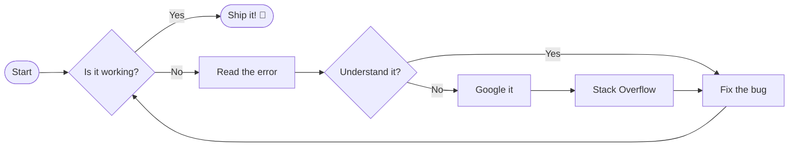
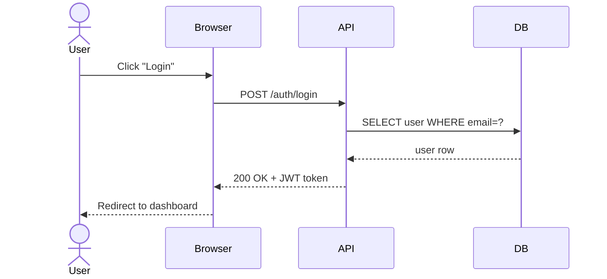
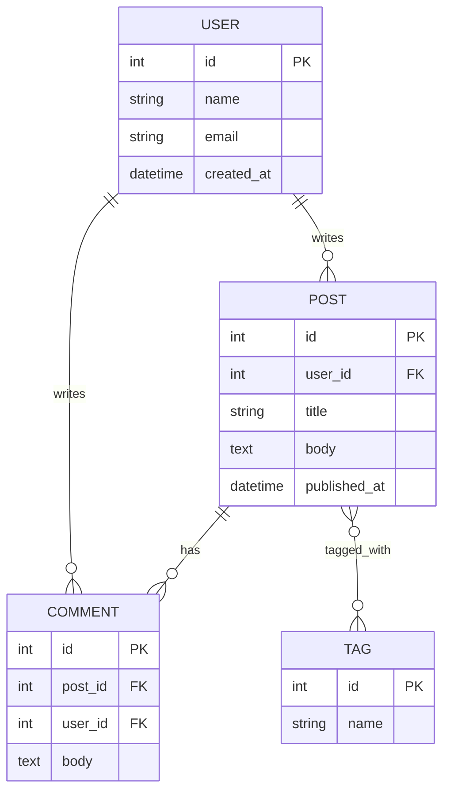
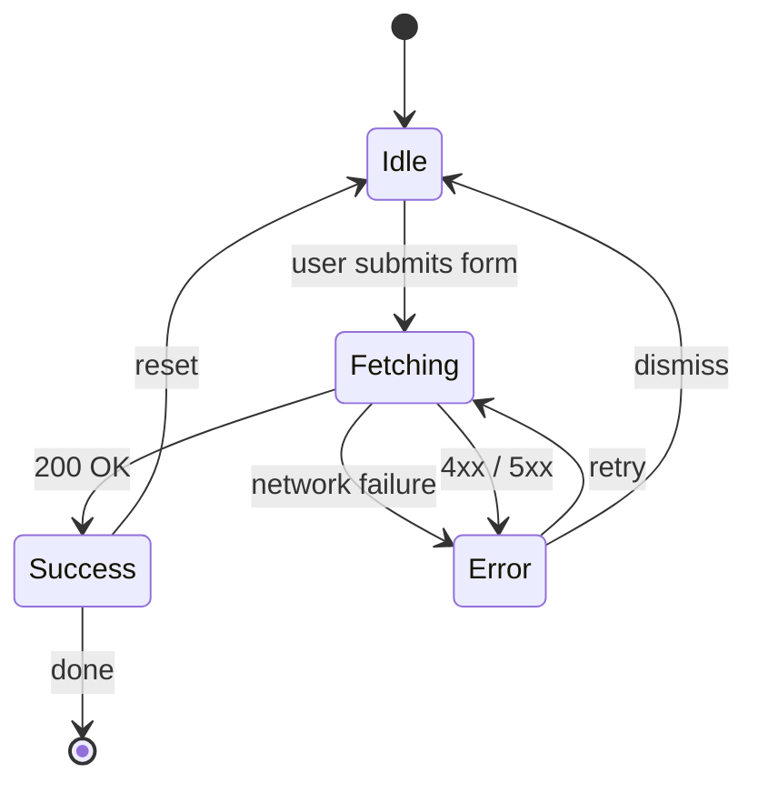
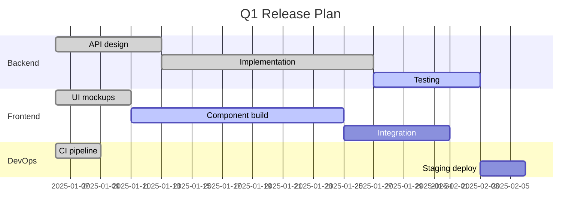
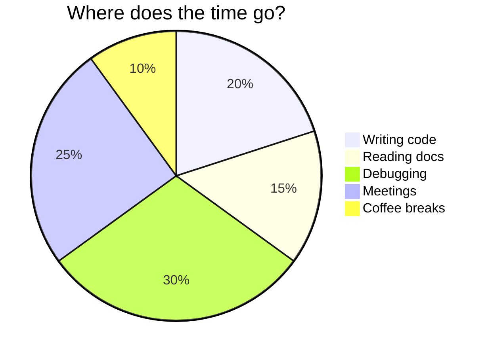
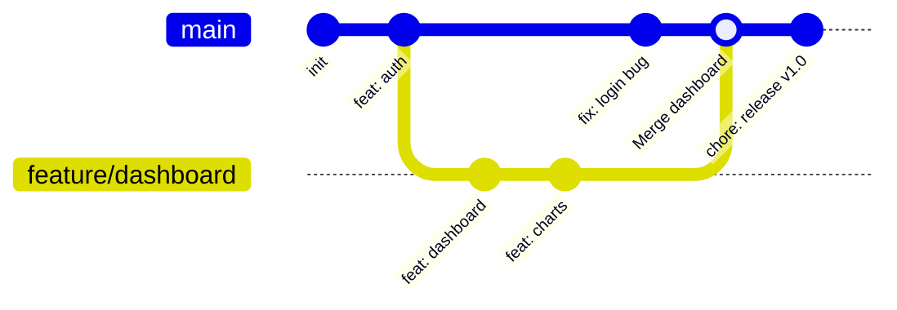
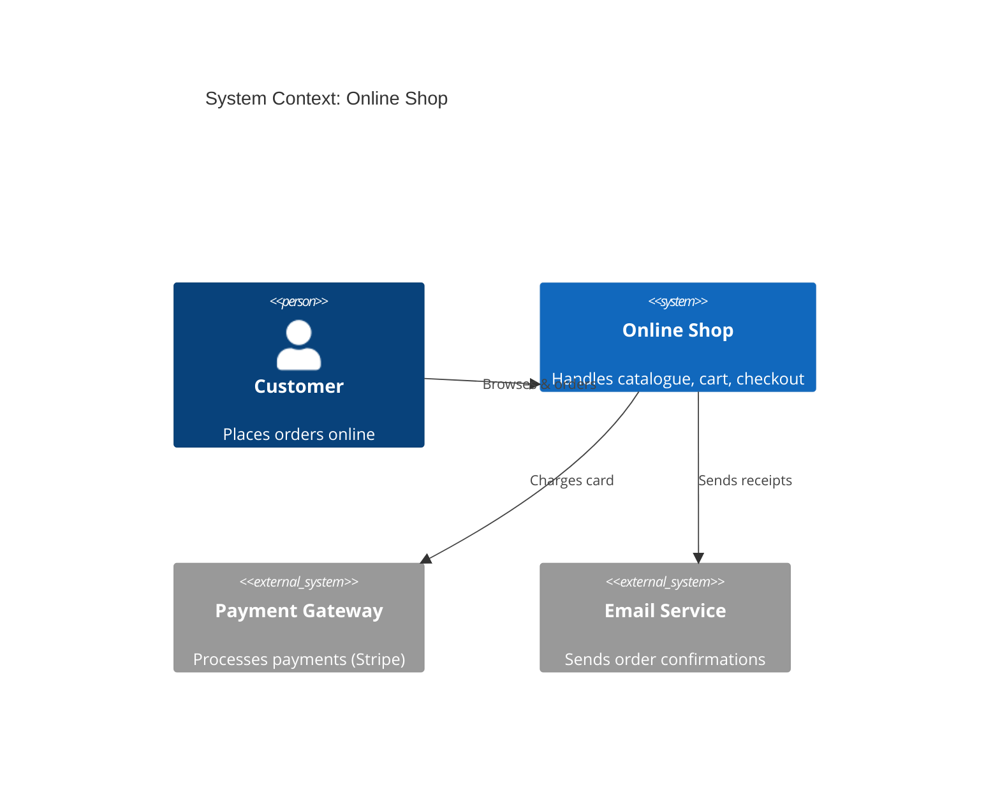

# Mermaid Diagrams

Click any diagram to open it fullscreen with pan & zoom

---

## Flowchart

---

## Sequence Diagram

---

## Entity Relationship Diagram

---

## State Diagram

---

## Gantt Chart

---

## Pie Chart

---

## Git Graph

---

## C4 Context Diagram

---

# Click to zoom!

Every diagram opens fullscreen with **pan & zoom** support.

Press **Escape** or click outside to close.
