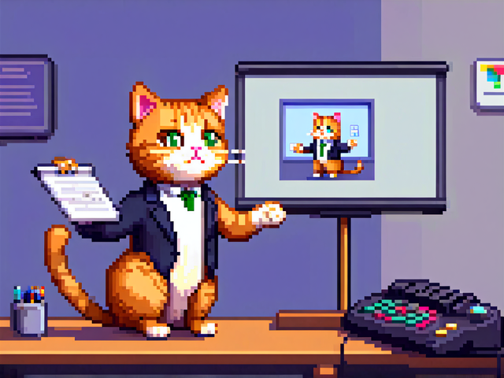

# Header 1 slides are centered

My cool presentation

---

## Javascript Code

```javascript
const canvas = document.createElement('canvas');
document.body.appendChild(canvas);
const ctx = canvas.getContext('2d');
// Define the rainbow colors
const colors = [
  { r: 255, g: 0, b: 0 }, // Red
  { r: 255, g: 128, b: 0 }, // Orange
  { r: 255, g: 255, b: 0 }, // Yellow
  { r: 0, g: 255, b: 0 }, // Green
  { r: 0, g: 0, b: 255 }, // Blue
  { r: 128, g: 0, b: 128 } // Purple
];

// Create a gradient
const gradient = ctx.createLinearGradient(0, 0, canvas.width, 0);
colors.forEach((color, index) => {
  gradient.addColorStop(index / (colors.length - 1), `rgb(${color.r}, ${color.g}, ${color.b})`);
});

// Draw the rainbow
ctx.fillStyle = gradient;
ctx.fillRect(0, 0, canvas.width, canvas.height);

// Add some animation
function animate() {
  ctx.clearRect(0, 0, canvas.width, canvas.height);
  ctx.fillStyle = gradient;
  ctx.fillRect(0, Math.sin(Date.now() * 0.001) * 50, canvas.width, canvas.height);
  requestAnimationFrame(animate);
}
animate();
```

---

## Some Diagram

Using MermaidJS

<figure class="mermaid">
graph TB
    A[Expectation 🤩] -->|Coding| B[Building cool features 🚀]
    A -->|Work environment| C[Chill office + free snacks 🍩]
    A -->|Career| D[Becoming a rockstar dev 🎸]
</figure>
<figure class="mermaid">
graph TB
    X[Reality 😅] -->|Coding| Y[StackOverflow copy-paste 🔍]
    X -->|Work environment| Z[Meetings about meetings 📅]
    X -->|Career| W[Fixing merge conflicts forever 🔄]
</figure>

---

## A picture

